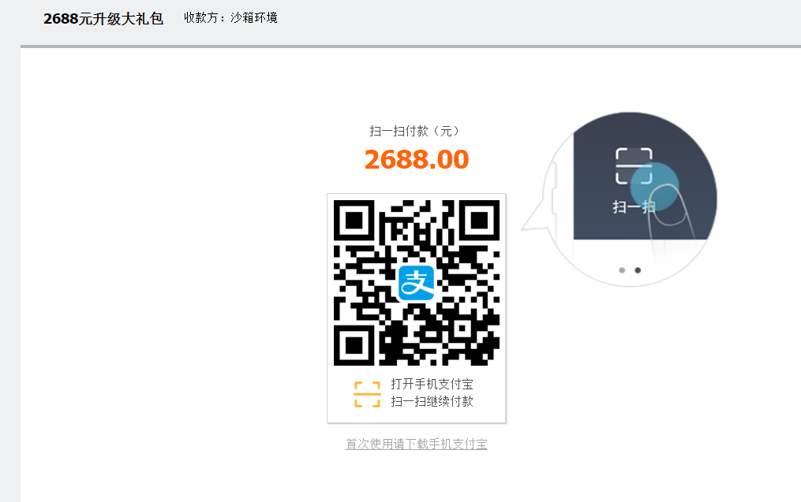

一、介绍
没有接触过支付宝支付的同学，包括一部分已经接触过支付宝支付，但只是使用sdk的同学，都不太了解支付宝支付时，到底内部都进行了什么处理，基于此，写此composer 包。

本包内部集成了 MD5、RSA、RSA2三种方式，目前支付宝官方推荐使用最新版本的RSA2。而且目前支付宝的沙箱也仅支持RSA2方式。

本包配置好参数之后，可以直接进行测试，这里再次推荐使用最新的RSA2方式。配置参数的方式也很简单。

　　

二、使用：

1、配置config.php 中的参数

```php
应用私钥：APP_PRIVATE_KEY

支付宝应用ID: ALI_PAY_APP_ID、ALI_PID

同步通知地址: RETURN_URL

异步通知地址：NOTIFY_URL

是否是测试环境：IS_DEV

如果使用 RSA 方式，需要配置 ALI_RSA_PUBLIC_KEY

如果使用 RSA2 方式，需要配置 ALI_RSA2_PUBLIC_KEY

如果使用 MD5 方式，需要配置 ALI_MD5_KEY

```
　　

2、实例化时，指定方式，MD5、RSA、RSA2，并将订单基本信息传过去。
　　

3、根据实际需求修改 notify.php 中日志记录。
　　

4、根据实际需求修改 Base.php 中的 checkOrderFee 和 changeOrderStatus 方法。

5、在调用的地方添加如下代码，即可运行

```php
<?php
require 'vendor/autoload.php';

// 应该从调用出传过来这些信息
$orderInfo = [
    'order_title' => '2688元升级大礼包',
    'order_id' => date('YmdHis').rand(100000, 999999),
    'total_fee' => 2688,
    'goods_desc' => '礼包包含超级经验石100块，助你快速升级'
];

// 实例化AliPay类，并指定方式为RSA2（也可以指定为老版本的md5和RSA，但是沙箱环境只支持RSA2方式）
new \haveyb\AliPay\AliPay('RSA2', $orderInfo);
```
　　

三、使用效果

　　

Powered by https:www.haveyb.com